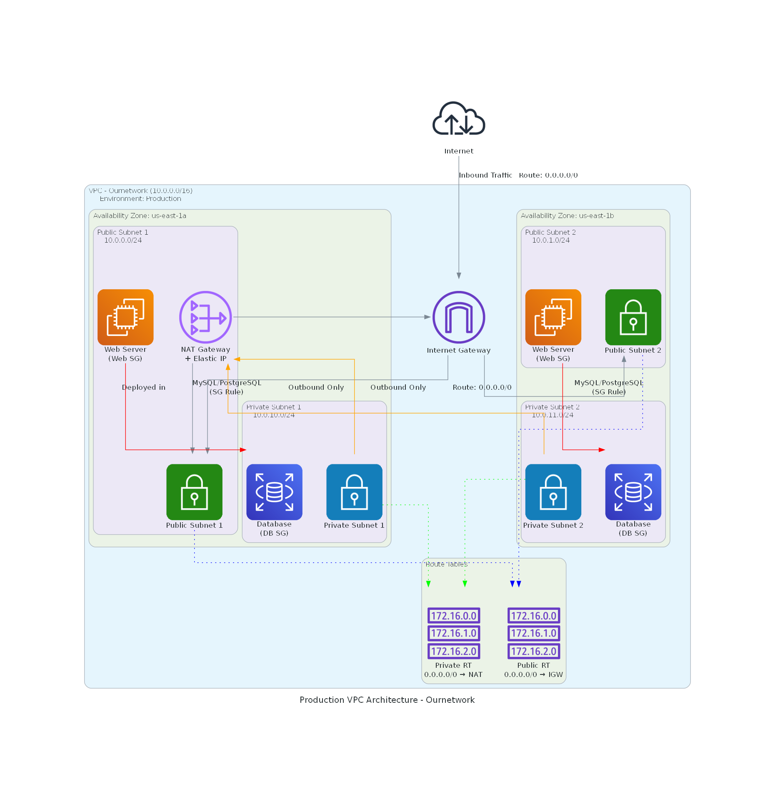

# AWS Production VPC Terraform Module
## Architecture Diagram

This repository contains a Terraform configuration to provision a standard, highly-available AWS networking environment. It is designed for production use-cases where private resources need internet access through a controlled gateway.

## Architecture Overview

This Terraform configuration provisions a production-ready VPC environment spanning two Availability Zones (us-east-1a and us-east-1b) for high availability. The VPC uses a 10.0.0.0/16 CIDR block, segmented into four subnets.
Two public subnets (10.0.0.0/24 and 10.0.1.0/24) provide direct internet connectivity through an Internet Gateway, designed for hosting load balancers, bastion hosts, and the NAT Gateway. Two private subnets (10.0.10.0/24 and 10.0.11.0/24) isolate application servers and databases from direct internet access while maintaining outbound connectivity through the NAT Gateway for updates and external API calls.
Routing is handled by separate route tables: public subnets route all traffic through the Internet Gateway for bidirectional communication, while private subnets route outbound traffic through the NAT Gateway, ensuring backend resources remain unreachable from the internet. Security groups enforce a defense-in-depth approach, with the Web Security Group allowing HTTP/HTTPS/SSH from the internet, and the Database Security Group restricting access exclusively to resources within the Web Security Group, preventing unauthorized lateral movement.